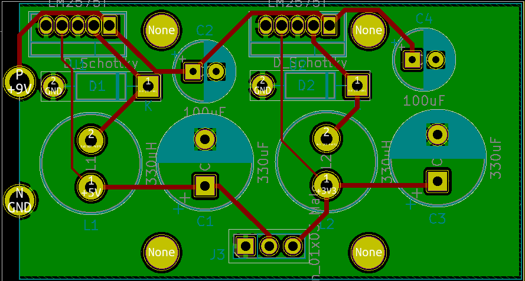
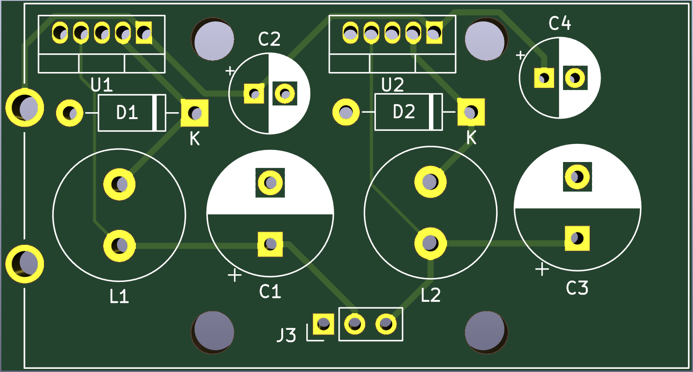
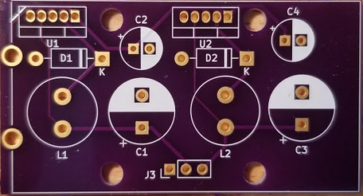

# EZ-Rail

EZ-rail is a small 3.3v & 5v 1A power supply that runs off of a 9v battery. It's indended for use testing & prototpying digital electronics when conventional lab power supply isn't available. The board itself is the size of a 9v battery & sits on top of a battery holder. All components are through-hole, making it a great beginner soldering project. 

 

 
 
